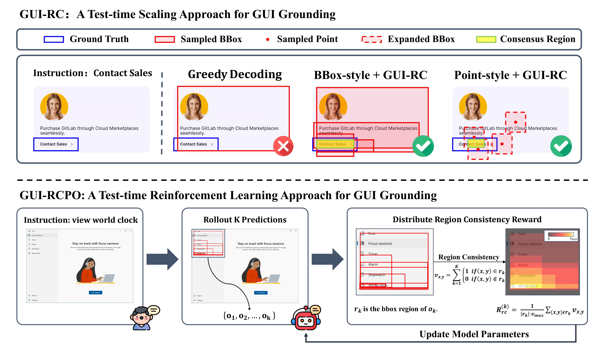

<h1 align="center">
  
  Test-Time Reinforcement Learning for GUI Grounding via Region Consistency
</h1>

<div align="center">

<p><em>A Test-time reinforcement learning framework for GUI grounding</em></p>


</div>

---

<div align="center">
  
  <p><em>GUI-RC: identify the consensus region across sampling to enable more precise grounding.</em></p>
  <p><em>GUI-RCPO: transform the region consistency into rewards, and enables models to self-improve on unlabeled data.</em></p>
</div>

---

## 🎉 News

[2025-8-7] We release our paper: **Test-Time Reinforcement Learning for GUI Grounding via Region Consistency**

---

## 💡 Motivation

Current GUI grounding approaches rely heavily on large-scale pixel-level annotations and training-time optimization, which are expensive, inflexible, and difficult to scale to new domains. we observe that when GUI models generate multiple predictions, spatial overlaps across generations naturally reflect the model's localization confidence. This simple insight leads to a critical question: 

_**Can we leverage test-time computation to enhance GUI grounding performance without additional labeled data?**_

Motivated by this, we introduce GUI-RC and GUI-RCPO to unlock the untapped potential of region consistency, which enables models to self-improve without the need for labeled data.

---

## ✨ Highlights

*  **GUI-RC (Region Consistency Voting)**: Aggregates multiple sampled predictions via spatial voting to identify the consensus region—achieves **+2–3%** accuracy gains **without any training**.
*  **GUI-RCPO (Region Consistency Policy Optimization)**: Converts region consistency into self-supervised rewards for test-time reinforcement learning—enables models to iteratively **improve on unlabeled data**, reaching **+4–5%** further gains.
*  **Self-Bootstrapping Capability**: Applying GUI-RC after GUI-RCPO leads to even higher accuracy—demonstrating that our methods support **progressive self-improvement** without external supervision.
*  **Robust Across Models and Benchmarks**: GUI-RC and GUI-RCPO generalize across multiple models and benchmarks, showing consistent performance boosts.

---

## 🚀 Quick Start
### Setup
```bash
conda create -n ttrl4gui python=3.10
conda activate ttrl4gui
bash setup.sh
```
### Running GUI-RC
```bash
cd TTRL4GUI/GUI-RC
python evaluation.py
```
Modify the following configurations in `evaluation.py`:
- `MODEL_PATH`: Model path
- `QUESTION_TEMPLATE`: Prompt template for specific model (default for Qwen2.5-VL)
- `TEMPERATURE`: Sampling temperature (default: 0.7)
- `SAMPLE_NUM`: Number of samples (default: 64)
- `POINT_EXPAND_SIZE`: Click region expansion size (default: 50)

### Training GUI-RCPO
```bash
cd TTRL4GUI/VLM-R1
sh run_scripts/run_gui_rcpo_Qwen2.5-VL-3B.sh
```
Modify the following configurations in training scripts:
```bash
data_paths="${PROJECT_ROOT}/data/your_dataset/your_data.jsonl"
image_folders="${PROJECT_ROOT}/data/your_dataset/images"
model_path="your_model_path"
```
Training data should follow the JSONL format demonstrated in:

```
TTRL4GUI/data/screenspot/example_training_data.jsonl
```


## 📊 Main Results
We evaluate our methods on three mainstream GUI grounding benchmarks: SceeenSpot, SceeenSpot-v2 and SceeenSpot-Pro.
### GUI-RC
| **Model** | **Mobile Text** | **Mobile Icon** | **Desktop Text** | **Desktop Icon** | **Web Text** | **Web Icon** | **SSv2.avg** | **SSv1.avg** | **SSPro.avg** |
|-----------|----------------|----------------|-----------------|-----------------|--------------|--------------|--------------|--------------|---------------|
| InternVL3-2B-Instruct | 89.92 | 76.44 | 38.89 | 26.19 | 46.43 | 25.32 | 52.75 | 51.02 | 1.03 |
| w/ **GUI-RC** | 89.92 | 77.49↑ | 38.33 | 24.60 | 46.07 | 27.00↑ | 52.91 (+0.16) | 52.20 (+1.18) | 1.33 (+0.30) |
| InternVL3-8B-Instruct | 94.19 | 79.58 | 79.44 | 53.17 | 91.07 | 71.73 | 80.97 | 79.72 | 13.28 |
| w/ **GUI-RC** | 94.19 | 81.15↑ | 80.56↑ | 56.35↑ | 91.07 | 71.73 | 81.68 (+0.71) | 80.03 (+0.31) | 12.46 (-0.82) |
| Qwen2.5-VL-3B-Instruct | 97.67 | 75.92 | 85.56 | 59.52 | 84.64 | 65.82 | 80.11 | 76.97 | 20.18 |
| w/ **GUI-RC** | 98.84↑ | 77.49↑ | 90.00↑ | 64.29↑ | 87.14↑ | 67.93↑ | 82.63 (+2.52) | 78.46 (+1.49) | 23.59 (+3.41) |
| Qwen2.5-VL-7B-Instruct | 98.84 | 84.29 | 86.67 | 73.81 | 88.57 | 78.90 | 86.48 | 84.20 | 19.80 |
| w/ **GUI-RC** | 99.92↑ | 85.86↑ | 91.11↑ | 73.02 | 91.79↑ | 81.43↑ | 88.52 (+2.04) | 85.53 (+1.33) | 23.97 (+4.17) |
| UGround-V1-7B | 96.51 | 82.72 | 96.11 | 82.54 | 92.50 | 83.12 | 89.62 | 87.11 | 31.50 |
| w/ **GUI-RC** | 96.51 | 83.77↑ | 95.56 | 84.13↑ | 92.86↑ | 81.43 | 89.62 (+0.00) | 87.34 (+0.23) | 31.63 (+0.13) |
| UI-TARS-1.5-7B | 96.51 | 86.39 | 95.00 | 87.30 | 88.21 | 86.50 | 90.17 | 87.74 | 40.92 |
| w/ **GUI-RC** | 96.12 | 86.91↑ | 96.11↑ | 90.48↑ | 90.36↑ | 86.50 | 91.12 (+0.95) | 88.52 (+0.78) | 41.18 (+0.26) |
| OS-Atlas-Base-7B | 91.47 | 72.25 | 88.33 | 64.29 | 86.43 | 72.57 | 80.82 | 79.80 | 18.41 |
| w/ **GUI-RC** | 91.47 | 78.53↑ | 88.89↑ | 68.25↑ | 89.29↑ | 76.37↑ | 83.57 (+2.75) | 81.45 (+1.65) | 19.67 (+0.16) |

### GUI-RCPO
| **Model** | **Mobile Text** | **Mobile Icon** | **Desktop Text** | **Desktop Icon** | **Web Text** | **Web Icon** | **SSv2.avg** | **SSv1.avg** | **SSPro.avg** |
|-----------|----------------|----------------|-----------------|-----------------|--------------|--------------|--------------|--------------|---------------|
| Qwen2.5-VL-3B-Instruct | 97.67 | 75.92 | 85.56 | 59.52 | 84.64 | 65.82 | 80.11 | 76.97 | 20.18 |
| w/ **GUI-RCPO** | 98.06↑ | 81.68↑ | 91.11↑ | 65.08↑ | 90.71↑ | 73.42↑ | 85.14 (+5.03) | 82.47 (+5.50) | 24.67 (+4.49) |
| Qwen2.5-VL-7B-Instruct | 98.84 | 84.29 | 86.67 | 73.81 | 88.57 | 78.90 | 86.48 | 84.20 | 19.80 |
| w/ **GUI-RCPO** | 98.84 | 87.43↑ | 91.11↑ | 76.19↑ | 92.50↑ | 80.17↑ | 88.92 (+2.48) | 86.64 (+2.44) | 25.93 (+6.13) |
| UI-TARS-1.5-7B | 96.51 | 86.39 | 95.00 | 87.30 | 88.21 | 86.50 | 90.17 | 87.74 | 40.92 |
| w/ **GUI-RCPO** | 97.29↑ | 86.39 | 97.22↑ | 82.54 | 91.07↑ | 87.34↑ | 90.96 (+0.79) | 88.60 (+0.86) | 41.43 (+0.51) |

---
## Case Study
### 1. Mitigating misleading hallucinations
<table class="center">
    <tr style="font-weight: bolder;text-align:center;">
        <td>Greedy Decoding</td>
        <td>GUI-RC</td>
    </tr>

  <tr>
  <td>
    
  </td>
  <td>
    
  </td>
  </tr>
</table>

### 2. Mitigating biased hallucinations
<table class="center">
    <tr style="font-weight: bolder;text-align:center;">
        <td>Greedy Decoding</td>
        <td>GUI-RC</td>
    </tr>

  <tr>
  <td>
    
  </td>
  <td>
    
  </td>
  </tr>
</table>

---
## 🙏 Acknowledgement

The GUI-RCPO Training code build from [VLM-R1 project](https://github.com/om-ai-lab/VLM-R1).

---
## 📄 Citation
Please consider citing our paper if our methods are useful:
```bib
@misc{du2025testtimereinforcementlearninggui,
      title={Test-Time Reinforcement Learning for GUI Grounding via Region Consistency}, 
      author={Yong Du and Yuchen Yan and Fei Tang and Zhengxi Lu and Chang Zong and Weiming Lu and Shengpei Jiang and Yongliang Shen},
      year={2025},
      eprint={2508.05615},
      archivePrefix={arXiv},
      primaryClass={cs.CV},
      url={https://arxiv.org/abs/2508.05615}, 
}
```
